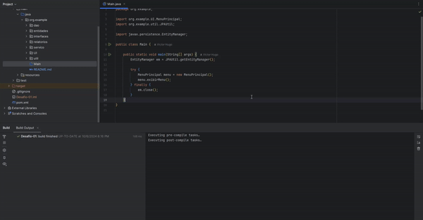

# 📚 Sistema de Gerenciamento de Biblioteca

## 📝 Descrição

Este projeto é um Sistema de Gerenciamento de Biblioteca, desenvolvido em Java, que permite realizar operações como cadastro de livros, autores, membros, além de gerenciar empréstimos e devoluções. O sistema inclui funcionalidades de geração de relatórios, cálculo de multas por atraso e categorização dos estados dos empréstimos.

## 📑 Índice

- [Funcionalidades](#funcionalidades)
- [Pré-requisitos](#pré-requisitos)
- [Configuração do Banco de Dados](#configuração-do-banco-de-dados)
- [Como Executar o Projeto](#como-executar-o-projeto)
- [Demonstração](#demonstração)
- [Estrutura de pastas](#Estrutur-de-pastas)

## 🚀 Funcionalidades

- **Cadastro de Livros:** Permite adicionar livros ao sistema, incluindo informações como título, autor, gênero, quantidade, e ISBN único.
- **Cadastro de Autores:** Cadastrar autores e associá-los aos livros.
- **Cadastro de Membros:** Cadastrar membros com informações de contato e endereço.
- **Empréstimo e Devolução de Livros:** Controla a saída e retorno de livros, calcula multas por atraso e verifica a disponibilidade dos livros.
- **Relatórios:** Gera relatórios detalhados sobre livros, membros, empréstimos, autores e empréstimos atrasados.

## 🧰 Pré-requisitos

Certifique-se de ter as seguintes ferramentas instaladas:

- [Java JDK 11+](https://www.oracle.com/java/technologies/javase-jdk11-downloads.html)
- [MySQL](https://dev.mysql.com/downloads/installer/): Um banco de dados MySQL configurado e em execução.
- [Maven](https://maven.apache.org/install.html): Para compilar e gerenciar as dependências do projeto.

## 🛠 Configuração do Banco de Dados

Antes de executar o projeto, é necessário configurar o banco de dados MySQL:

1. Crie um banco de dados chamado `Desafio_01` no MySQL.
2. No arquivo `persistence.xml`, configure as credenciais de acesso ao banco de dados.

## 🚀 Como Executar o Projeto

1. **Clone o repositório:**

    ```bash
    git clone https://github.com/VictorHugoCC/SP_SpringBoot_AWS_Desafio_01.git
    cd SP_SpringBoot_AWS_Desafio_01/Desafio-01/src/main/java/org.example/main
    ```
   E então execute o programa.


<h1>🎬 Demonstração</h1>

### Iniciando o projeto e exibindo o menu principal: 


## 📂 Estrutura de Pastas

### dao

- **Repositorio:** Classe que implementa as operações básicas de persistência de dados. Tambem inicializa o CRUD.

### entidades
- **Autor:** Representa os autores dos livros.
- **Emprestimo:** Gerencia as informações de empréstimos, como datas, multas e estados.
- **Livro:** Representa os livros na biblioteca, com informações de autor, ISBN, e quantidade disponível.
- **Membro:** Contém as informações dos membros da biblioteca.
- **Pessoa:** Classe base para Membro e Autor.

### interfaces
- **Relatorio:** Interface que define o método `gerarRelatorio()` para a geração de relatórios personalizados.

### relatorios
- **RelatorioAutores:** Gera um relatório com informações dos autores cadastrados.
- **RelatorioEMAtrasados:** Lista empréstimos atrasados e detalha os dias de atraso.
- **RelatorioEmprestimos:** Apresenta um relatório geral de todos os empréstimos.
- **RelatorioLivros:** Relatório detalhado sobre todos os livros, incluindo autores e disponibilidade.
- **RelatorioMembros:** Gera um relatório com detalhes de todos os membros.

### servico
Explicação detalhada dos métodos principais de cada classe de serviço:

- **AutorService**
   - `buscarAutor(String nome)`: Busca um autor pelo nome. Útil para verificar se o autor já está cadastrado antes de adicionar um novo autor.

- **EmprestimoService**
   - `realizarEmprestimo(int idMembro, int idLivro, Date dataEmprestimo)`: Registra um empréstimo de livro. Verifica a disponibilidade do livro e associa ao membro.
   - `concluirEmprestimo(int idEmprestimo, Date dataDevolucao)`: Conclui o empréstimo de um livro. Calcula a multa, se houver atraso, e atualiza o estado do empréstimo.
   - `calcularDiasAtraso(Date dataEmprestimo, Date dataDevolucao)`: Calcula a diferença em dias entre as datas de empréstimo e devolução para determinar o atraso.
   - `listarEmprestimosAtrasados()`: Retorna uma lista de empréstimos cujo estado é "ATRASADO".

- **GenericService<T>**
   - Esta classe é uma camada de abstração para operações comuns de persistência, como salvar, atualizar, deletar e buscar entidades pelo ID. Isso permite reutilizar métodos genéricos em outros serviços, evitando duplicação de código.

- **LivroService**
   - `buscarLivro(String isbn)`: Localiza um livro usando o ISBN, útil para validação de duplicatas durante o cadastro de livros.

- **MembroService**
   - `buscarMembro(String email)`: Busca um membro usando o e-mail, permitindo identificar se o membro já está cadastrado antes de adicioná-lo ao sistema.

### UI
- **AutorMenu:** Interface de usuário para cadastro e gerenciamento de autores.
- **EmprestimoMenu:** Interface de usuário para gerenciar empréstimos e devoluções de livros.
- **LivroMenu:** Interface de usuário para cadastro e gerenciamento de livros.
- **MembroMenu:** Interface de usuário para cadastro e gerenciamento de membros.
- **MenuPrincipal:** Interface principal que conecta todas as funcionalidades do sistema.
- **RelatoriosMenu:** Interface de usuário para geração de diferentes relatórios.

### util
- **InputUtil:** Métodos auxiliares para captura e validação de entrada do usuário.
- **JPAUtil:** Configuração do EntityManager para persistência de dados.